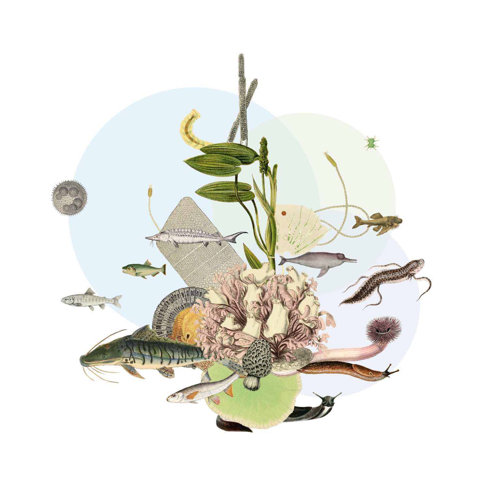

// add cover image to img directory and update filename below
ifdef::backend-html5[]

endif::backend-html5[]

== Colophon

=== Suggested citation

Lento J & Schmidt-Kloiber A (2024) Freshwater Data Publishing Guide. GBIF Secretariat: Copenhagen. https://doi.org/10.35035/doc-sw3k-w725

=== Authors

https://orcid.org/0000-0002-8098-4825[Jennifer Lento^] & https://orcid.org/0000-0001-8839-5913[Astrid Schmidt-Kloiber^]

=== Licence

The document _Freshwater Data Publishing Guide_ is licensed under https://creativecommons.org/licenses/by-sa/4.0[Creative Commons Attribution-ShareAlike 4.0 Unported License].

=== Persistent URI

https://doi.org/10.35035/doc-sw3k-w725

=== Document control

v.0.9.0 for community review, February 2024

=== Cover image

Eastern hellbender (_Cryptobranchus alleganiensis_), Pennsylvania, United States. Photo 2016  Anthony Brais via https://www.gbif.org/occurrence/2543069391[iNaturalist Research-grade Observations^], licensed under http://creativecommons.org/licenses/by-nc/4.0/[CC BY-NC 4.0].
